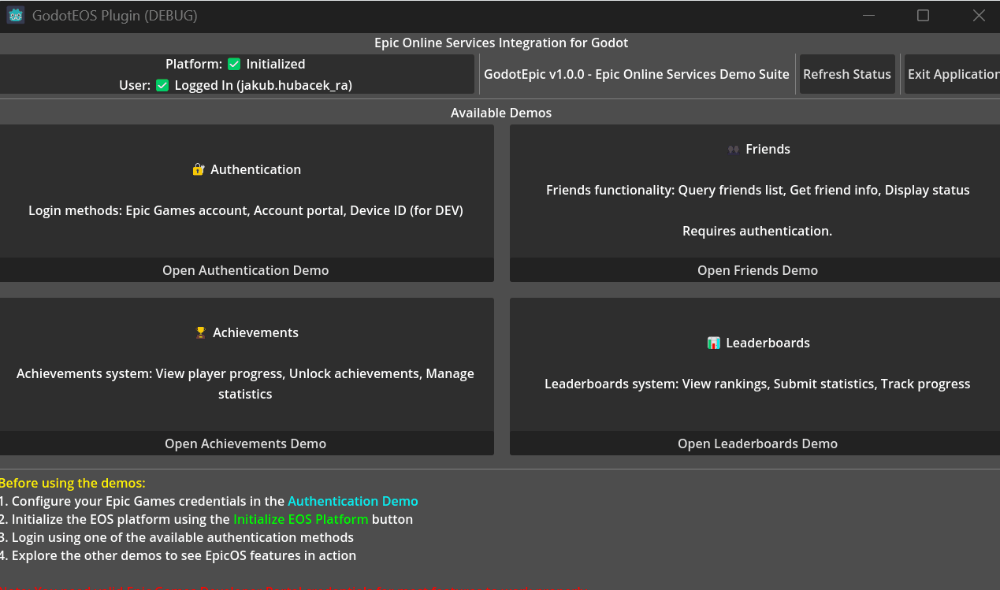
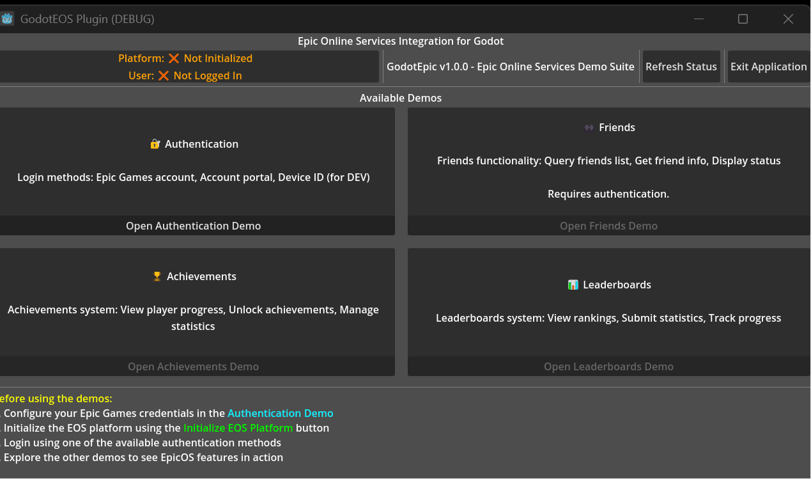

# GodotEOS
**Epic Online Services (EOS) Integration for Godot Engine**

A comprehensive GDExtension plugin that brings Epic Games Online Services to Godot Engine, enabling developers to integrate achievements, leaderboards, authentication, friends, and more into their games.

## 🚀 Features

- **Authentication**: Epic Games login and license validation
- **Achievements**: Unlock and query player achievements
- **Statistics**: Track and update player stats
- **Leaderboards**: Submit scores and retrieve rankings
- **Friends**: Query and manage player friends lists
- **Cross-Platform**: Windows and Linux support
- **GDScript Integration**: Simple API calls with signal-based callbacks

## 📋 Prerequisites

- Godot Engine 4.3 or higher
- Epic Games Developer Account
- EOS SDK (included in releases)
- Visual Studio 2019/2022 (Windows) or VS Code or GCC (Linux)

## 🛠️ Installation

### Method 1: Download Release
1. Download the latest release from [GitHub Releases](https://github.com/Flying-Rat/GodotEpic/releases)
2. Extract the plugin to your project's `addons/` folder
3. Enable the plugin in Project Settings → Plugins

### Method 2: Build from Source
1. Clone this repository
2. Ensure you have the EOS SDK in the `godot_eos_extension/eos_sdk/` folder
3. Build using SCons:
   ```bash
   scons platform=windows target=template_debug
   ```
4. Copy the built library to your project

## ⚙️ Setup

### 1. Epic Developer Portal Configuration
1. Create a project in the [Epic Developer Portal](https://dev.epicgames.com/)
2. Configure your application settings
3. Note your Product ID, Sandbox ID, and Deployment ID

### 2. Godot Project Setup
1. Add the GodotEOS plugin to your project
2. Create an autoload for `EpicOS` (the plugin will handle this automatically)
3. Configure your EOS credentials in the project settings

### 3. Initialize EOS
```gdscript
extends Node

func _ready():
    # Connect to EOS signals
    EpicOS.login_completed.connect(_on_login_completed)
    EpicOS.achievement_unlocked.connect(_on_achievement_unlocked)

    # Initialize EOS
    EpicOS.initialize()

func _on_login_completed(success: bool, user_info: Dictionary):
    if success:
        print("Login successful: ", user_info.display_name)
    else:
        print("Login failed")
```

## 🎯 Quick Start

### Authentication
```gdscript
# Login with Epic Games account
EpicOS.login()

# Check if user is logged in
if EpicOS.is_logged_in():
    print("User is authenticated")
```

### Achievements
```gdscript
# Unlock an achievement
EpicOS.unlock_achievement("first_victory")

# Query achievement progress
EpicOS.query_achievements()
```

### Statistics
```gdscript
# Update a player statistic
EpicOS.update_stat("games_played", 1)

# Get current stats
var stats = EpicOS.get_stats()
print("Games played: ", stats.games_played)
```

### Leaderboards
```gdscript
# Submit a score
EpicOS.submit_score("high_scores", 1500)

# Get leaderboard data
EpicOS.get_leaderboard("high_scores", 10)  # Top 10 scores
```

## 📡 API Reference

### Signals
- `login_completed(success: bool, user_info: Dictionary)`
- `achievement_unlocked(achievement_id: String)`
- `stats_updated(stats: Dictionary)`
- `leaderboard_retrieved(leaderboard_data: Array)`

### Methods
- `initialize()` - Initialize the EOS SDK
- `login()` - Authenticate with Epic Games
- `logout()` - Sign out the current user
- `is_logged_in() -> bool` - Check authentication status
- `unlock_achievement(id: String)` - Unlock an achievement
- `query_achievements()` - Retrieve achievement data
- `update_stat(id: String, value: int)` - Update a statistic
- `get_stats() -> Dictionary` - Get current statistics
- `submit_score(board_id: String, score: int)` - Submit leaderboard score
- `get_leaderboard(board_id: String, count: int)` - Get leaderboard entries

## 🎮 Demo Project

This repository **IS** a complete demo project showcasing all EOS features! You can run it directly to test the plugin functionality. The demo includes:

- **Authentication UI**: Login/logout with Epic Games account
- **Achievement Testing**: Unlock achievements and track progress
- **Statistics Tracking**: Update and retrieve player statistics
- **Leaderboard Integration**: Submit scores and view leaderboard rankings
- **Friends Management**: Query and display friends lists
- **Real-time Output Log**: Monitor EOS operations and responses

### How to Run the Demo

1. Open this project in Godot Engine 4.x
2. Enable the GodotEOS plugin in Project Settings → Plugins
3. Run the project (scenes/demos/demo_menu.tscn)
4. Follow the on-screen instructions to test EOS features

#### Demo GIFs






### Demo Workflow

1. **Initialize**: The demo automatically initializes EOS when started
2. **Login**: Click "Login with Epic Games" to authenticate
3. **Test Features**: Once logged in, use the feature buttons to test different EOS APIs
4. **Monitor Output**: Watch the output log to see EOS responses and status updates


### Demo Project Structure

- `scenes/demos/demo_menu.tscn` - Main demo scene with interactive UI
- `scripts/main_demo.gd` - Demo logic and UI event handling
- `addons/godoteos/` - GodotEOS plugin files
  - `epic_os.gd` - Main EOS interface singleton (mock implementation)
  - `plugin.cfg` - Plugin configuration
  - `plugin.gd` - Plugin activation/deactivation logic

### For Plugin Users

When the plugin is complete, developers can:
- Copy the `addons/godoteos/` folder to their own projects
- Use the same API calls demonstrated in `scripts/main_demo.gd`
- Reference this demo as a complete integration example

## 🔧 Building

### Windows
```bash
# Debug build
scons platform=windows target=template_debug

# Release build
scons platform=windows target=template_release
```

### Linux
```bash
# Debug build
scons platform=linux target=template_debug

# Release build
scons platform=linux target=template_release
```

## 🐛 Troubleshooting

### Common Issues

**Plugin not loading:**
- Ensure the GDExtension library is in the correct path
- Check that all EOS SDK dependencies are available
- Verify Godot version compatibility (4.x required)

**Authentication failing:**
- Verify your Epic Developer Portal configuration
- Check Product ID, Sandbox ID, and Deployment ID
- Ensure your application is properly configured in the portal

**Features not working:**
- Make sure the corresponding features are enabled in Epic Developer Portal
- Check that your application has the required permissions
- Verify network connectivity and firewall settings

### Debug Mode
Enable debug logging to see detailed EOS operations:
```gdscript
EpicOS.set_debug_mode(true)
```

## 🤝 Contributing

1. Fork the repository
2. Create a feature branch (`git checkout -b feature/amazing-feature`)
3. Commit your changes (`git commit -m 'Add some amazing feature'`)
4. Push to the branch (`git push origin feature/amazing-feature`)
5. Open a Pull Request

## 📄 License

This project is licensed under the MIT License - see the [LICENSE](LICENSE) file for details.

## 🙏 Acknowledgments

- Epic Games for the EOS SDK
- GodotSteam project for inspiration
- Godot Engine community

## 📞 Support

- Create an issue on GitHub for bug reports
- Join the discussion in GitHub Discussions
- Check the [Epic Developer Documentation](https://dev.epicgames.com/docs/) for EOS-specific questions

---

**Status**: 🚧 In Development - See [GUIDE.md](GUIDE.md) for setup instructions